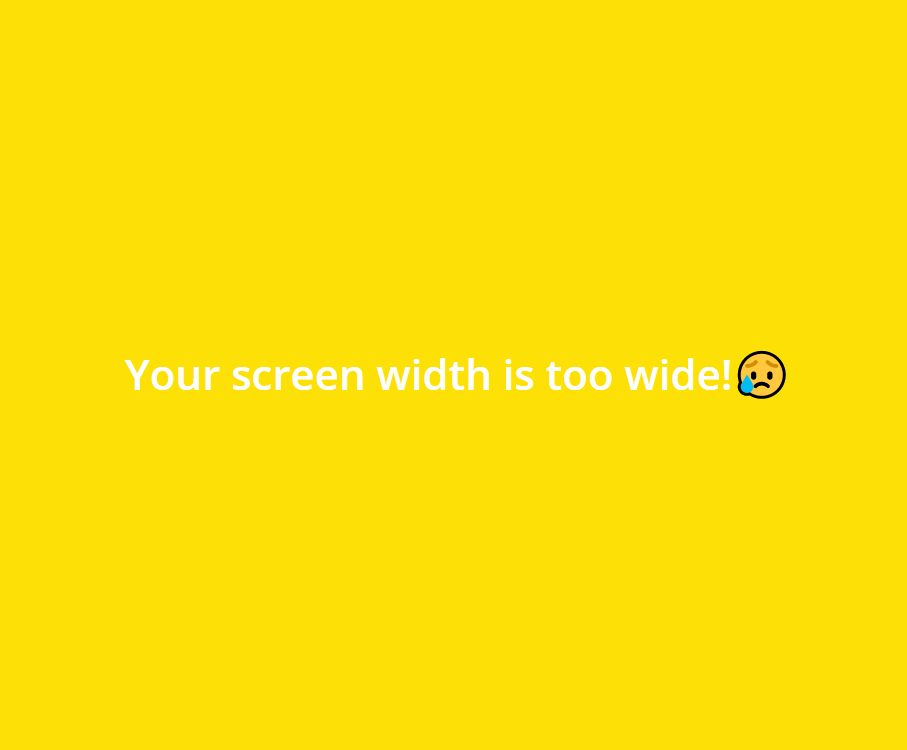
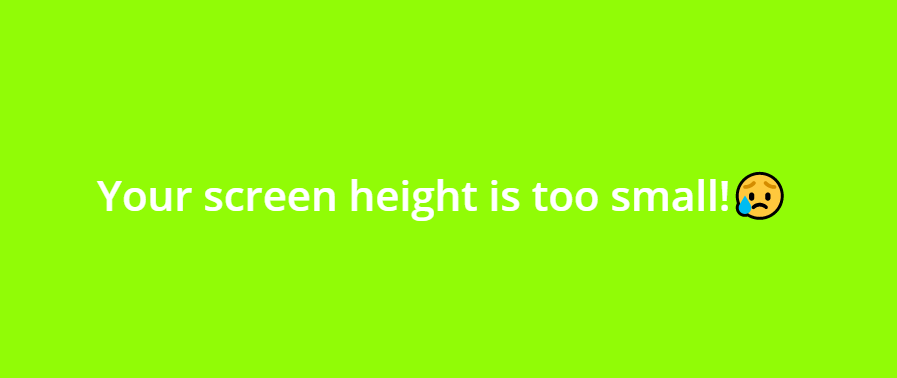
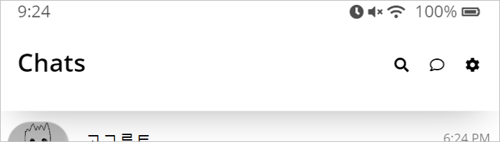
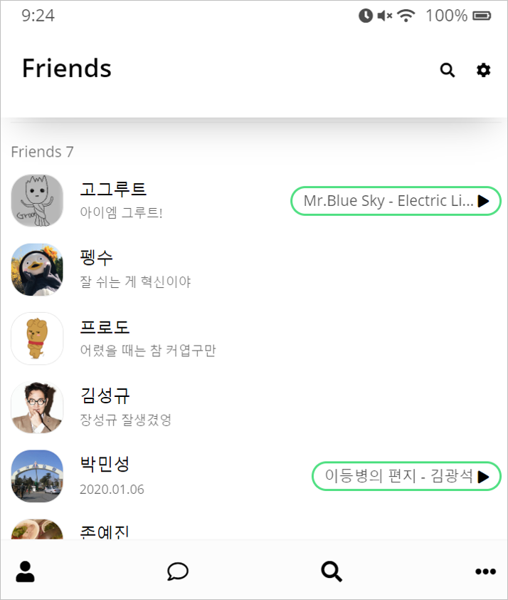
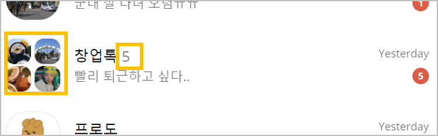
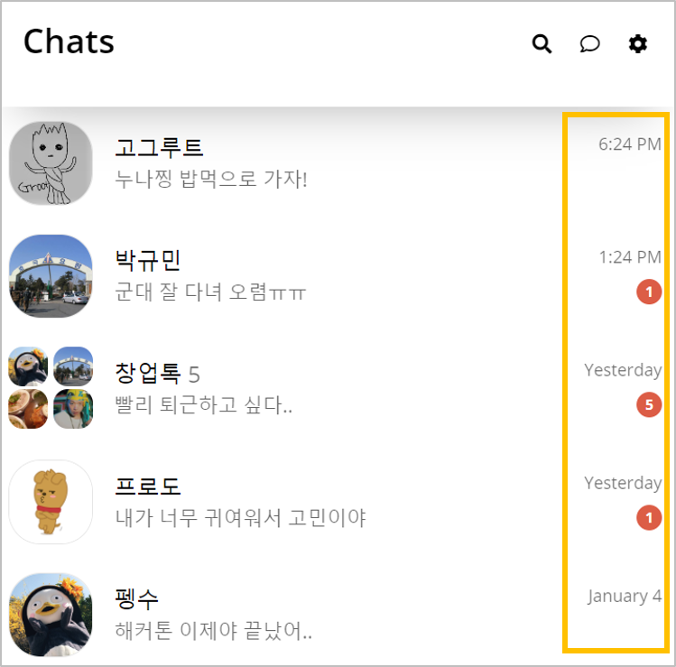
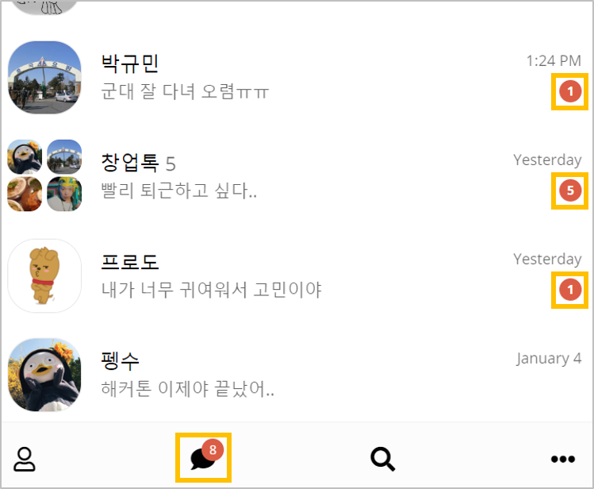
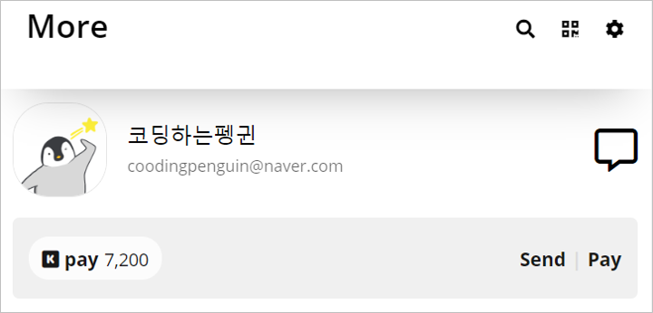
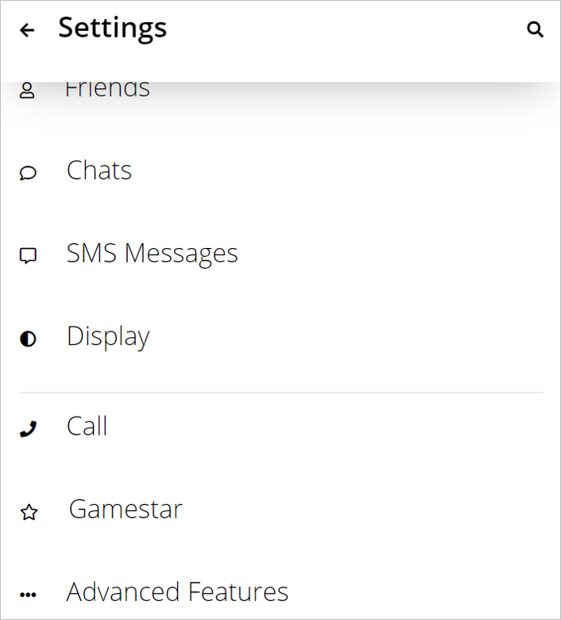

# 4th Kakao Clone Challenge Graduate Work

I only write about **WHAT I DID** except things Nicolas teacher did.

👉[See the final version of Kakao Clone](https://coodingpenguin.github.io/kakao-clone/index.html)👈

- [Screen Size Warning](#1-screen-size-warning)
  - [Screen Width](#screen-width)
  - [Screen Height](#screen-height)
- [Header Wrapper](#2-header-wrapper)
- [Friends Page](#3-friends-page)
- [Chats Page](#4-chats-page)
  - [Make a Group Chat](#make-a-group-chat)
  - [Sort Chats and Modify Timestamps](#sort-chats-and-modify-timestamps)
  - [Make Unread Chats](#make-unread-chats)
- [Kakao Pay](#5-kakao-pay)
- [Settings Page](#6-settings-page)

---

## 1. Screen Size Warning

#### Screen Width

If your screen width is over 550px, the following page appears.

#### Screen Height

If your screen height is under 200px, the following page appears.

## 2. Header Wrapper

Add `header wrapper` to all pages. So although you scroll the page, the header is fixed.

## 3. Friends Page

I added more friend elements of `friends-list` and changed each profile photo. And I also synchronized `Friends 7` and the number of friends.

## 4. Chats Page

#### Make a Group Chat

I made a group chat with more than four people except me. And I also marked how many people are in there next to the name of the chat.

#### Sort Chats and Modify Timestamps

I sorted chats by time. So the higher a message is placed, the later it arrives. Of course I synchronized the date.

#### Make Unread Chats

I made some unread messages and added unread badges below the timestamp and also synchronized the number of remained messages.

## 5. Kakao Pay

Today's Kakao Talk has Kakao Pay. So I added `Kakao Pay Tab` to the page.

## 6. Settings Page

I added more setting tabs to the page.

---

[☝ go back to the top](#4th-kakao-clone-challenge-graduate-work)
